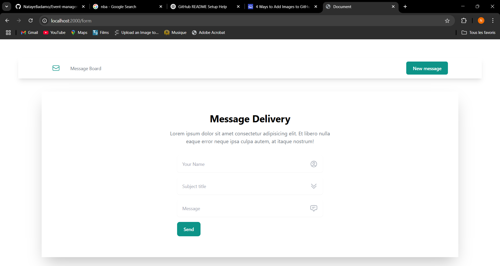

# message_board

# 💬 Simple Messaging App

A lightweight and user-friendly messaging application where users can view messages posted by others, view full message details, and submit their own messages to the board in real time.

---

## 📝 Description

This messaging platform provides a shared space for users to post and read messages. Each message displays the sender's name, subject, content, and the time it was created. Built with EJS for server-side rendering and styled with Tailwind CSS, it offers a clean and responsive interface.

---

## 📌 Features

- 🧾 View all user-submitted messages in a dashboard
- 🔍 See message details including full content
- ✍️ Add new messages instantly
- ⏰ Timestamp included for each message
- 🖥️ Server-side rendering with EJS templates

---

## 🛠 Tech Stack

- **Templating Engine:** [EJS](https://ejs.co/)
- **Styling:** [Tailwind CSS](https://tailwindcss.com/)
- **Backend:** [Node.js](https://nodejs.org/), [Express.js](https://expressjs.com/)

---

